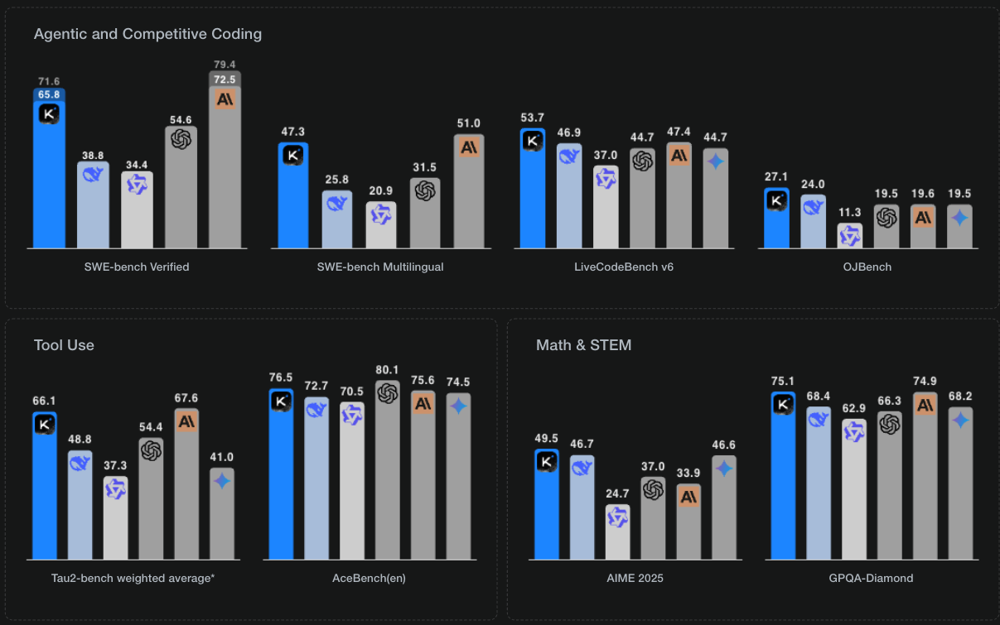
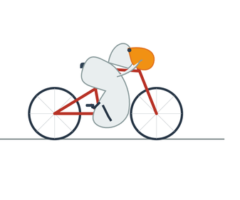
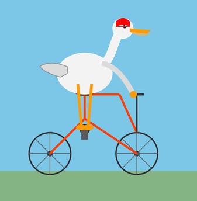
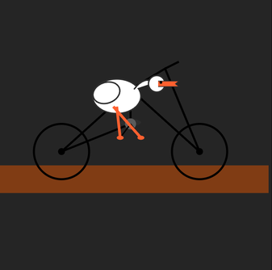
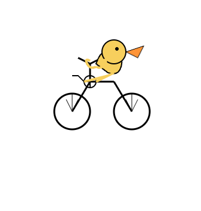
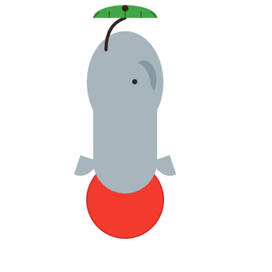
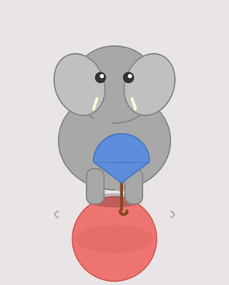
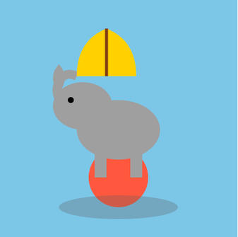

AI World welcomes another brand new open source Model: [Kimi K2](https://www.kimi.com/), and in non-thinking mode, it not only rivals (Claude Opus 4) but surpasses (GPT-4.1, Claude Sonnet 4) the performance of leading models in [SWE-bench](https://moonshotai.github.io/Kimi-K2/#:~:text=85.6-,SWE%2Dbench%20Verified,-(Agentless%20Coding)) .

In this blog post, I'm putting four different AI models to the test to see how well they can generate SVG (Scalable Vector Graphics) code for two prompts. The goal is to evaluate their ability to understand and translate natural language descriptions into structured, viewable vector images while having fun in the process.

The competing models are the latest [Kimi K2](https://www.kimi.com/), [Claude Opus](https://claude.ai/), [Gemini 2.5 Pro](https://gemini.google.com/) and [DeepSeek v3-0526](https://chat.deepseek.com/).

The two challenges are basically two prompts:

1.  A pelican riding a bicycle. (Credit to [Simon Wilson](https://simonwillison.net/2025/Jul/11/kimi-k2/))
2.  An elephant balancing on a ball while holding an umbrella in its trunk.

Let's dive in and see how each model performed!

---

### Task 1: A Pelican Riding a Bicycle 🚲

Here, I asked each model to generate the SVG code for a pelican riding a bicycle. The ideal output should be a recognizable representation of both the pelican and the bicycle, with the pelican in a plausible riding position.

#### **[Gemini 2.5 pro]**

**📝 Evaluation:**

**Clarity and Recognizability:** 5.5/10

From the beak of the bird, I can figure out that it is a pelican, riding a bicycle with its otherwise plump legs. The bicycle is clearly recognizable though.

**Pelican Posture:** 6/10

The pelican’s pose is spot-on for the vibe—looks like it’s about to launch off the seat. It’s perched on the bike and gripping the bars like a pro. Only hitch: it’s ghosting the pedals. No feet in sight, just one lonely leg line hanging out without pushing. So, technically, it’s “riding” in spirit only.

**Bicycle Structure:** 5/10

The bicycle got the classic frame, two wheels, seat, and bars, but it’s basically a fixie that forgot its entire drivetrain. No chain, no chainring, no gears… just one lonely pedal floating there like it’s on strike.

**Final Rating:** 5.5/10

#### **[Claude Opus]**

**📝 Evaluation:**

**Clarity and Recognizability:** 4/10

Honestly, that bird just screams “random white goose with a spray-tan bill.” No pouch, no pelican vibes—might as well be a stork in disguise. And the bike? Picture someone welded a modern frame to a penny-farthing’s ego. Between the mystery bird and the franken-cycle, the whole thing’s more confused than cool.

**Pelican Posture:** 7/10

The bird’s sitting up straight, totally into it—one wing on the bars like it owns the road, legs pumping the pedals like it’s out for a joyride. Bonus points for the little red helmet; super cute and totally on-brand.

**Bicycle Structure:** 6.5/10

Bike’s legit—old-school direct-drive with the pedals right on the front hub, no chain needed. Bars and wheels are where they should be. Only snag: there’s zero seat, so the rider’s just plonked on the metal frame. Ouch.

**Final Rating:** 5.8/10

#### **[Kimi K2]**

**📝 Evaluation:**

**Clarity and Recognizability:** 3/10

Bird-wise, we’ve got a plain white flyer with a teensy orange flag for a beak—no pouch in sight, so “pelican” is a stretch. The bike’s a flashy chopper and you can tell what it is, but the star of the prompt? Not really showing up.

**Pelican Posture:** 6/10

Props where they’re due—the bird’s got two solid legs and both feet are actually on the pedals, cranks mid-spin like it’s cruising down the boardwalk. Best “yep, it’s riding” moment we’ve seen so far.

**Bicycle Structure:** 6.5/10

Bike looks like a sweet chopper—love that laid-back fork—but it’s missing the basics: no seat to park your butt and no chain to turn the pedals into motion. So it’s basically a cool frame with nowhere to sit and no way to roll. Props for keeping the rear triangle, though—at least that bit’s legit.

Final Rating: 5.2/10

#### **[DeepSeek V3-0526]**

**📝 Evaluation:**

**Clarity and Recognizability:** 2/10

The bike’s fine for a doodle, but that yellow blob with the tiny triangle beak? Total duckling energy—no pouch, no pelican vibe. Most folks would just go, “Aww, a baby duck on a bike!”

**Pelican posture:** 2/10

Props for showing the little guy actually pedaling—feet are on the cranks and everything. But it’s basically squatting on the handlebars (or maybe the top tube?) like it forgot the seat exists… which, yikes, is sitting right there behind it. Makes zero sense and looks mega uncomfortable.

**Bicycle Structure:** 3/10

Bike’s got the basics—frame, wheels, seat, bars, even pedals you can see the rider pushing. Classic AI moment, though: totally skipped the chain, so it’s a pretty but useless two-wheeler.

Final Rating: 2.3/10

---

### Task 2: An Elephant Balancing on a Ball with an Umbrella 🐘☂️

For the second task, the models were prompted to create an SVG of an elephant balancing on a ball while holding an umbrella in its trunk. This is a more complex scene requiring the model to understand multiple objects and their relationships.

#### **[Gemini Pro 2.5]**

**📝 Evaluation:**

**Clarity and Recognizability of the action:**

Total chaos. From up there, it’s a blob of lines—you gotta squint and guess what’s even going on. Rating: 2/10

**Elephant position:**

Elephant’s on the ball, sure, but the weird angle makes it look more like it’s just chilling there—no clear “balancing” vibe at all. Rating: 3/10

**Umbrella Structure:**

Somewhat recognizable as an umbrella top. But the green color is misleading. Rating: 5/10

#### **[Claude Opus]**

**📝 Evaluation:**

**Clarity and Recognizability of the action:**

Something is balancing itself on the ball for sure. Rating: 7/10

**Elephant position:**

Looks more like some rounded greyish ball on top a pink one. The mouse like eyes don't inspire confidence either. Rating: 5/10

**Umbrella Structure:**

Is that an umbrella or a cotton candy? If you squint really hard, you can see the bottom end, resembles that of an umbrella-ish stick. Rating: 4/10

#### **[Kimi K2]**

**📝 Evaluation:**
**Clarity and Recognizability of the action:**

An animal is clearly standing on a ball holding sth. Rating: 6/10

**Elephant position:**

Elephant or monkey? not sure. But the position is correct. Rating: 7/10

**Umbrella Structure:**

Barely resembles one. Rating: 3/10

#### **[DeepSeek V3-0526]**

**📝 Evaluation:**

**Clarity and Recognizability of the action:**

The gummy elephant’s chillin’ on the ball, no prob, but the thing in its trunk? Looks more like a sad bendy straw than any umbrella I’ve seen. Rating: 7/10

**Elephant position:**

The elephant seems to be correctly balanced on top of the ball. Rating: 10/10

**Elephant Structure:**

Yep, it’s an elephant all right—just the ultra-simple, “I-skipped-the-details” version. Rating: 6/10

**Umbrella Structure:**

Barely resembles an umbrella. Rating: 3/10

---

### Conclusion and Final Thoughts

After reviewing the outputs from all four models:

**🏆 Best Overall Performer:** None

So there you have it—our totally unscientific, just-for-fun rundown of AI-generated pelicans, elephants, and the questionable bikes they insist on riding. Take every score with a fistful of popcorn, because this whole thing is strictly for giggles and zero engineering credits. Now go forth, pedal your imagination, and remember: if your pelican shows up without a pouch, just blame the algorithm and enjoy the chaos!
